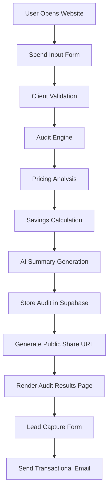

# Architecture Overview

PromptSpend is a full-stack AI spend audit platform built using Next.js, TypeScript, Supabase, and Anthropic AI.

The platform allows startups and engineering teams to analyze AI tooling expenses, identify overspending, and receive optimization recommendations through a shareable audit report.

---

# System Architecture



---

# Data Flow

## 1. User Input

The user enters:
- AI tools used
- Current plans
- Monthly spend
- Team size
- Primary use case

The form state persists locally to prevent accidental data loss on page refresh.

---

## 2. Audit Engine Processing

The audit engine evaluates:
- Plan suitability
- Seat utilization
- Potential downgrades
- Alternative AI tooling recommendations
- Annualized savings opportunities

The engine uses deterministic business rules instead of AI-generated financial calculations.

---

## 3. AI Summary Generation

After the pricing analysis is completed, the platform sends the audit result to the Anthropic API to generate a personalized summary paragraph.

If the AI request fails:
- the application falls back to a deterministic templated summary
- the audit still completes successfully

---

## 4. Database Storage

Audit reports and captured leads are stored in Supabase.

Stored data includes:
- audit metadata
- recommendations
- calculated savings
- generated summaries
- optional lead capture details

Personally identifiable information is excluded from public audit pages.

---

## 5. Public Share URLs

Each audit receives a unique public slug:
```bash
/audit/[slug]
```

The public page:
- excludes email/company information
- supports Open Graph previews
- supports Twitter card previews
- can be shared publicly

---

# Tech Stack Decisions

## Next.js

Chosen for:
- App Router support
- server-side rendering
- dynamic metadata generation
- optimized deployment with Vercel
- scalable routing for public audit pages

---

## TypeScript

Chosen to:
- reduce runtime bugs
- improve maintainability
- provide safer audit engine logic
- improve developer tooling and autocomplete

---

## Tailwind CSS + shadcn/ui

Used for:
- rapid UI development
- responsive layouts
- accessible component primitives
- consistent design system

---

## Supabase

Chosen because:
- PostgreSQL fits structured audit data well
- simple API integration
- built-in authentication and storage capabilities
- easy deployment and scaling

---

## Anthropic API

Used only for:
- personalized audit summaries

Financial calculations remain fully rule-based to ensure predictable outputs.

---

# Security Considerations

- Environment variables stored securely
- No secrets committed to repository
- Public audit pages exclude private user information
- Input validation implemented
- Basic abuse protection added for lead capture

---

# Scalability Considerations

If the application needed to support 10,000+ audits per day:

## Planned Improvements

### 1. Database Optimization
- Add indexed queries
- Add caching layer
- Optimize audit retrieval performance

### 2. Background Job Processing
- Move AI summary generation into async job queues
- Reduce response latency

### 3. Rate Limiting
- Add distributed rate limiting
- Protect AI API endpoints from abuse

### 4. Edge Deployment
- Move static rendering and caching closer to users
- Improve global response times

### 5. Monitoring
- Add structured logging
- Add analytics and error tracking
- Add uptime monitoring

---

# Project Structure

```bash
/app
  /audit/[slug]
  /api
/components
/lib
/tests
/types
/public
```

---

# Why Rule-Based Audit Logic?

Pricing optimization requires:
- predictable outputs
- transparent reasoning
- reproducible calculations

LLM-generated financial advice may hallucinate pricing or provide inconsistent recommendations.

For that reason:
- AI is used only for summaries
- all pricing calculations remain deterministic
